# Analyse des températures mondiales

> Analyse de l'évolution des anomalies de température mondiale, des émissions de gaz à effet de serre et de leurs relations à l'aide de Python, du Machine Learning et de Power BI.

## Présentation du projet

Ce projet, réalisé dans le cadre de ma formation de Data Analyst, porte sur l'étude de l'évolution des températures terrestres et de leurs relations avec les émissions de gaz à effet de serre.

L'analyse s'appuie principalement sur les données climatiques de la NASA (GISTEMP / L-OTI et AIRS v7), enrichies par des données environnementales, démographiques et économiques issues de Our World in Data (OWID).

Le projet couvre plusieurs étapes d'une analyse de données : préparation et transformation des données, analyse exploratoire, visualisation, comparaison de modèles prédictifs, projection des températures et conception d'un rapport interactif sous Power BI.

Le travail initial a été réalisé dans le cadre d'un projet collectif. Il a ensuite été approfondi à travers mon rapport individuel, mes travaux de modélisation et la conception du rapport Power BI interactif présenté dans ce dépôt.

## Objectifs

L'objectif principal de ce projet est d'analyser l'évolution des températures terrestres depuis la fin du XIXe siècle et d'explorer les facteurs pouvant être associés au réchauffement observé.

L'étude vise notamment à :

- analyser l'évolution des anomalies de température à l'échelle mondiale, par hémisphère et par zone climatique ;
- comparer les données climatiques issues de GISTEMP / L-OTI et d'AIRS v7 ;
- mettre en évidence les disparités régionales, notamment l'amplification du réchauffement dans les régions polaires ;
- étudier les relations entre température, émissions de CO₂, population et indicateurs économiques ;
- comparer différentes approches de modélisation afin d'étudier et de projeter l'évolution des températures ;
- restituer les résultats au travers de visualisations Python et d'un rapport BI interactif sous Power BI.

## Sources de données

L'analyse repose sur plusieurs jeux de données complémentaires :

- **NASA GISTEMP / L-OTI** : anomalies de température terrestre sur la période **1880–2025**, disponibles à différentes échelles géographiques (globale, hémisphères et zones climatiques) ;
- **NASA AIRS v7** : données satellitaires de température sur la période **2003–2025**, utilisées notamment pour comparer les tendances observées avec celles de L-OTI ;
- **Our World in Data (OWID)** : données environnementales, démographiques et économiques couvrant la période **1750–2024**, comprenant notamment les émissions de CO₂, la population, le PIB et le mix énergétique.

Les premières observations du jeu de données OWID, remontant à 1750, ne concernent qu'un nombre restreint de pays. Sa couverture géographique s'enrichit progressivement au fil du temps avec l'intégration des données de nouveaux pays.

Le croisement de ces sources permet d'étudier simultanément l'évolution des températures, les disparités géographiques et plusieurs indicateurs liés aux activités humaines.

Pour certaines analyses comparatives, les périodes ont été harmonisées afin de travailler sur un intervalle temporel commun aux différentes sources.

## Technologies et outils

- **Python** : pandas, NumPy, Matplotlib, Seaborn, scikit-learn, Prophet ;
- **Jupyter Notebook** : préparation des données, analyses exploratoires, visualisations et modélisation ;
- **Power BI** : modélisation des données, création de mesures DAX et conception d'un rapport interactif ;
- **Power Query** : transformation et préparation des données destinées au rapport Power BI.

## Structure du projet

Le dépôt est organisé autour des différentes étapes et livrables du projet :

- `data/` : jeux de données utilisés pour les analyses et le rapport Power BI ;
- `notebooks/` : notebooks Jupyter consacrés à l'analyse exploratoire, aux visualisations et à la modélisation ;
- `power bi/` : rapport Power BI interactif ;
- `report/` : rapport individuel présentant l'ensemble de ma démarche et de mes analyses ;
- `presentation/` : support de présentation réalisé dans le cadre du projet collectif ;
- `images/` : sélection de visualisations et d'extraits des différents travaux présentés dans ce README.

## Analyses et résultats

### Rapport individuel

Le rapport individuel de 54 pages présente l'ensemble de ma démarche, depuis la préparation des données jusqu'à leur analyse, leur modélisation et leur restitution sous Power BI.

  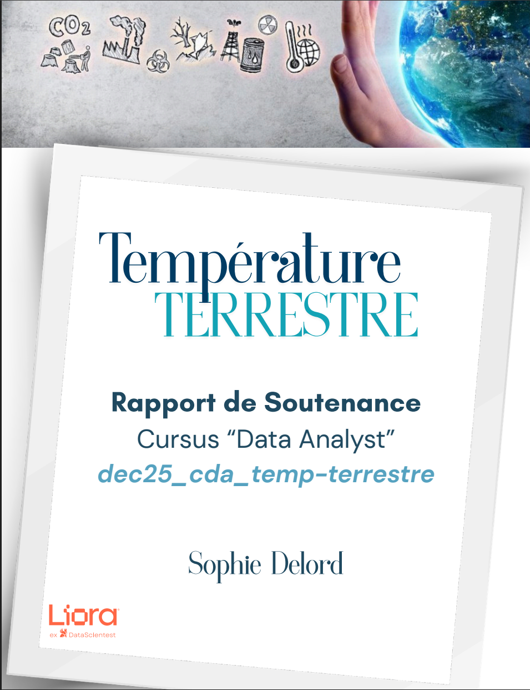
  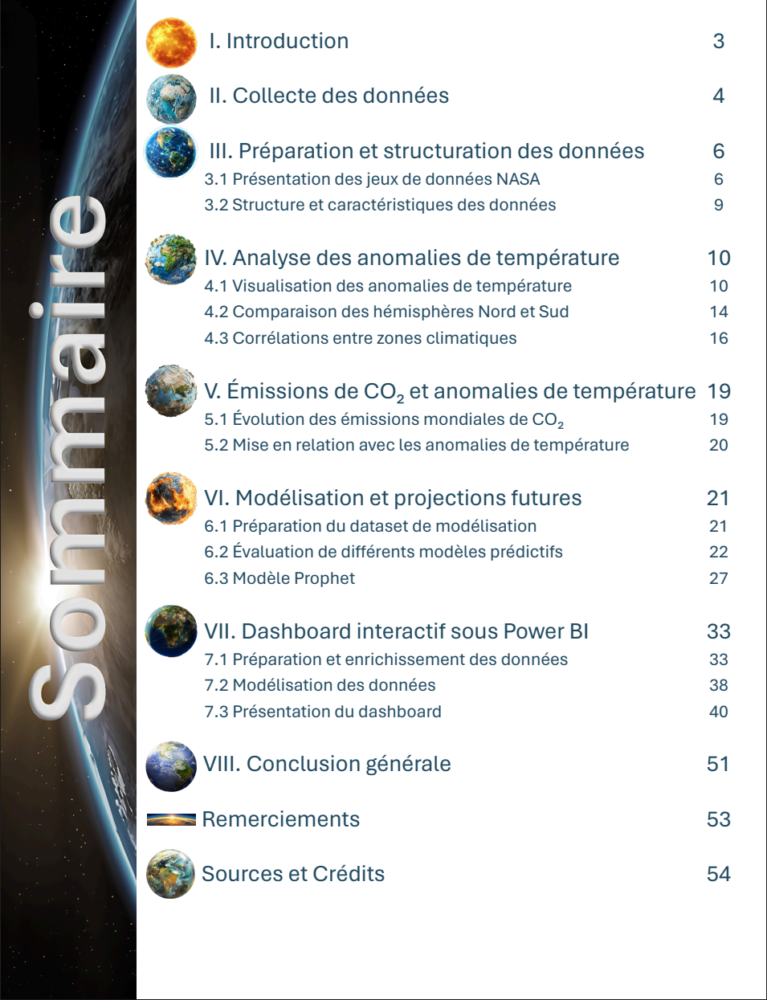

Il approfondit notamment l'analyse des disparités climatiques observées entre les différentes régions du globe. L'étude met en évidence une augmentation particulièrement marquée des anomalies de température dans l'hémisphère Nord et plus spécifiquement dans la région arctique.

#### Amplification arctique

L'analyse des données L-OTI fait apparaître un réchauffement nettement plus important dans l'Arctique que dans les autres zones climatiques. Le rapport approfondit ce phénomène d'amplification arctique et ses principaux mécanismes, notamment la rétroaction liée à la diminution de l'albédo.

  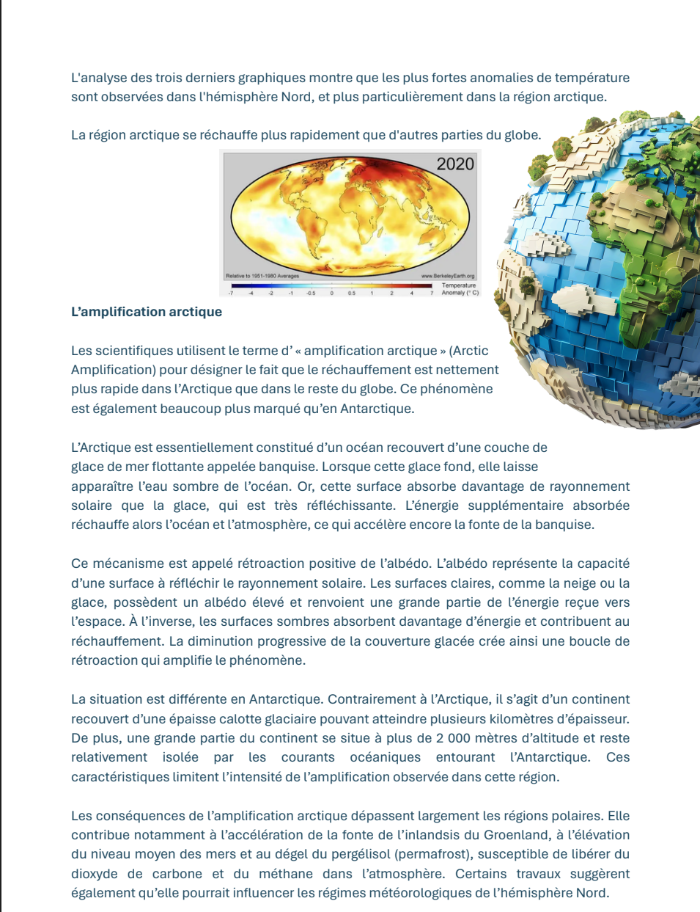

#### Modélisation des données pour Power BI

La conception du rapport Power BI a également nécessité la construction d'un modèle relationnel permettant de croiser les données climatiques de la NASA avec les données environnementales, démographiques et économiques d'OWID.

Le modèle s'articule notamment autour de la table principale `owid-co2-data`, d'une dimension géographique `code_pays_owid`, des données d'anomalies de température L-OTI et d'une table `Calendar` créée pour harmoniser les analyses temporelles.

  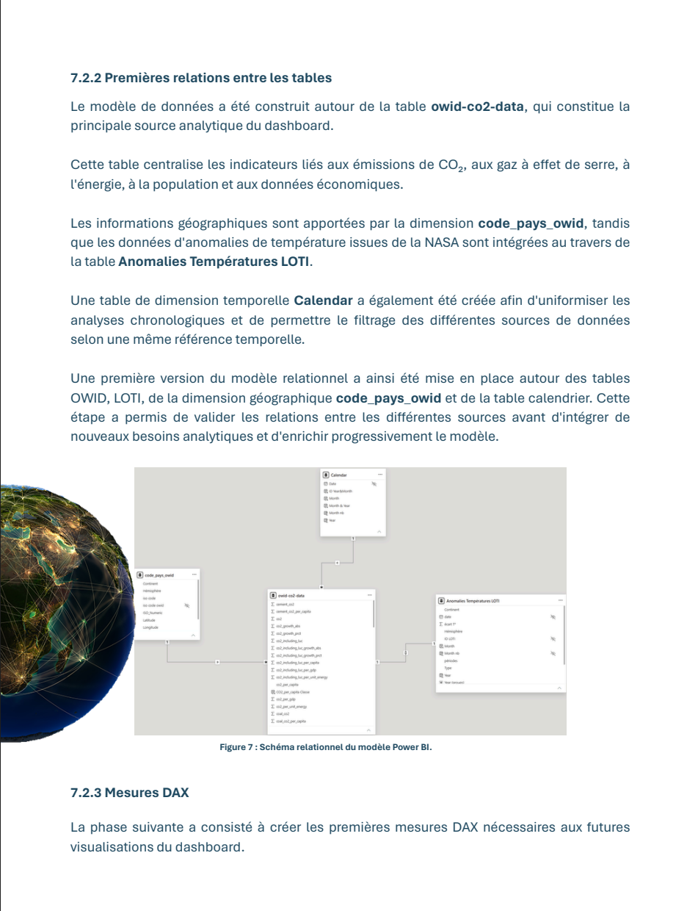

### Analyses avec Python

Les premières étapes du projet ont été réalisées sous Python afin d'explorer les données climatiques, de comparer les différentes sources et d'étudier leur évolution dans le temps.

#### Dispersion des anomalies de température

Les données L-OTI permettent d'analyser les anomalies de température selon quatre niveaux de découpage géographique :

- **Global** : ensemble du globe ;
- **Hémisphères** : hémisphères Nord et Sud ;
- **Zones climatiques** : Arctique, Antarctique, zones tempérées, subtropicales et tropicales réparties entre les hémisphères Nord et Sud ;
- **Grandes zones latitudinales** : extratropiques Nord, Tropiques et extratropiques Sud.

Le boxplot ci-dessous compare la distribution des anomalies pour l'ensemble de ces catégories. Il met notamment en évidence une dispersion plus importante dans les régions polaires, tandis que plusieurs zones tropicales et tempérées présentent des distributions plus resserrées.

  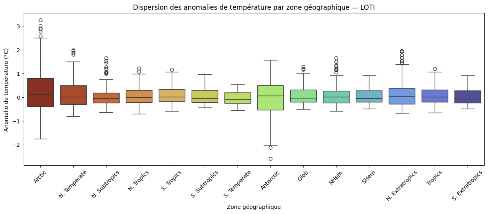

#### Comparaison des données L-OTI et AIRS v7

Les relations entre les anomalies de température des hémisphères Nord et Sud ont été comparées à partir des deux sources NASA.

La différence de densité entre les deux nuages de points s'explique principalement par les périodes couvertes : **L-OTI s'étend de 1880 à 2025**, tandis que **AIRS v7 couvre la période 2003–2025**. Chaque point représentant une année, la série L-OTI comporte naturellement davantage d'observations.

Malgré cette différence de profondeur historique, les deux sources permettent d'observer la relation entre l'évolution des anomalies de température des deux hémisphères.

  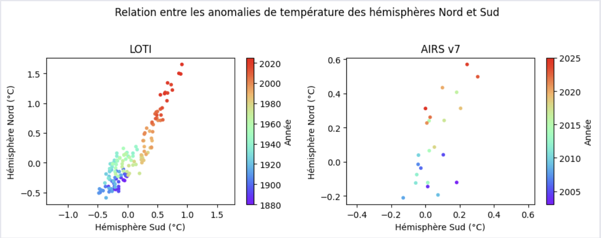

#### Modélisation et projection avec Prophet

Après l'analyse descriptive, une modélisation de la série temporelle L-OTI a été réalisée avec **Prophet** afin d'en prolonger la tendance jusqu'en 2050.

Le modèle présenté ici est adapté à la fréquence annuelle des données : la composante de saisonnalité annuelle n'est pas utilisée. La projection prolonge la tendance observée dans les données historiques et est accompagnée de son intervalle d'incertitude.

  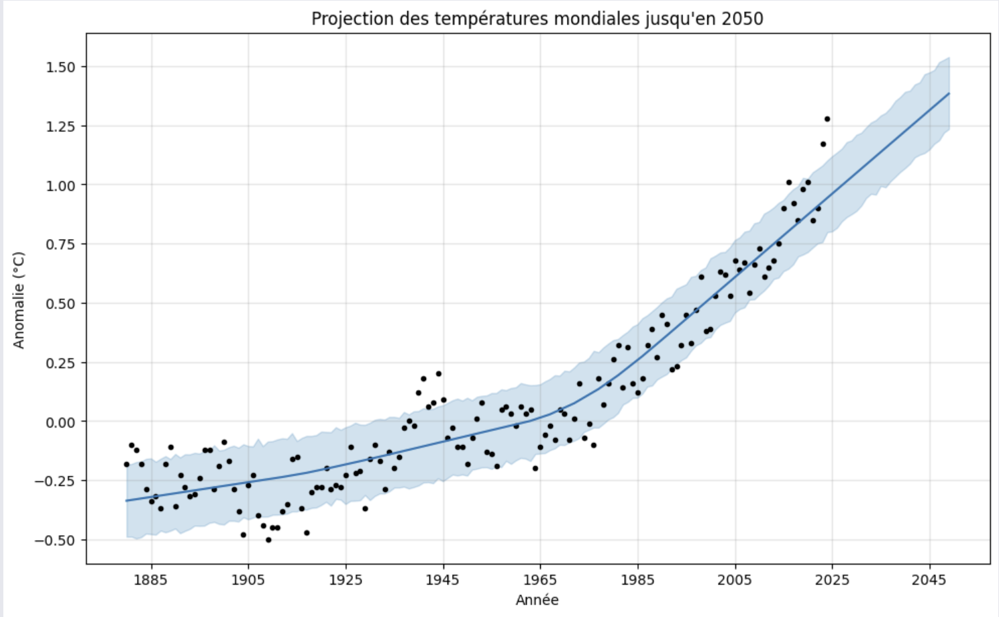

## Rapport BI interactif — Power BI

Dans le cadre du projet collectif, j'ai pris en charge l'intégralité de la conception et du développement du rapport BI sous Power BI.

À partir des tables préparées par les différents membres de l'équipe, j'ai réalisé leur intégration et leurs transformations dans Power Query, puis construit le modèle de données nécessaire aux analyses. J'ai également créé les relations entre les tables, les mesures DAX, les visualisations, les filtres et les interactions du rapport.

Des tooltips personnalisés ont également été créés afin d'afficher des informations complémentaires au survol de certains visuels, sans surcharger les pages du rapport.

La conception des trois pages du rapport, leur organisation et leur mise en forme ont également été réalisées par mes soins. **L'identité visuelle du rapport Power BI a été adaptée à partir de la charte graphique utilisée pour le rapport collectif, afin de conserver une cohérence visuelle entre les différents livrables du projet.** Les autres membres du groupe sont intervenus en fin de réalisation pour une relecture du rapport et quelques ajustements d'apparence.

Le rapport est organisé autour de trois axes d'analyse :
- l'évolution des anomalies de température ;
- les émissions de CO₂ et leurs principaux déterminants ;
- les relations entre température, émissions et variables démographiques.

### Quelques visualisations

#### Évolution des anomalies de température

  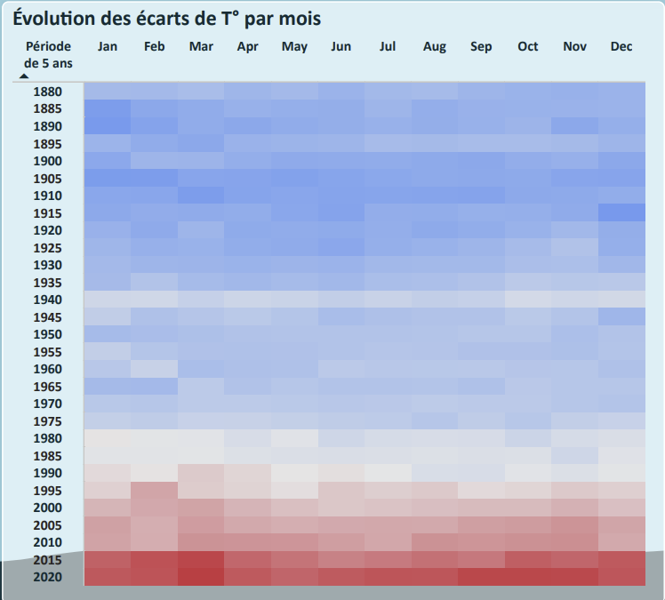

La heatmap met en évidence l'évolution progressive des anomalies de température au fil des décennies. Les périodes les plus récentes se distinguent nettement par la généralisation d'anomalies positives sur l'ensemble des mois de l'année.

#### Mix énergétique et émissions de CO₂

  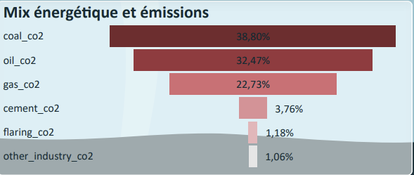

Cette visualisation présente la répartition des émissions de CO₂ liées aux principales sources d'énergie. Le charbon, le pétrole et le gaz représentent la très grande majorité des émissions observées.

#### Corrélation entre émissions de CO₂ et température

  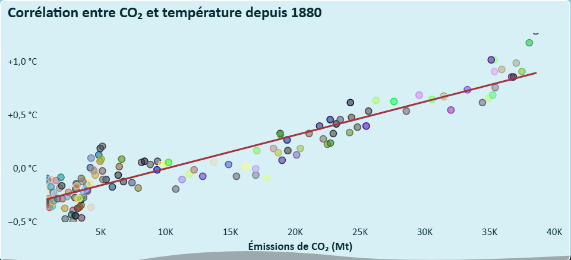

La mise en relation des émissions mondiales de CO₂ avec les anomalies de température depuis 1880 fait apparaître une relation positive entre les deux variables, particulièrement visible à partir de l'accélération des émissions au cours du XXe siècle.

### Aperçu du rapport BI

#### Analyse des températures

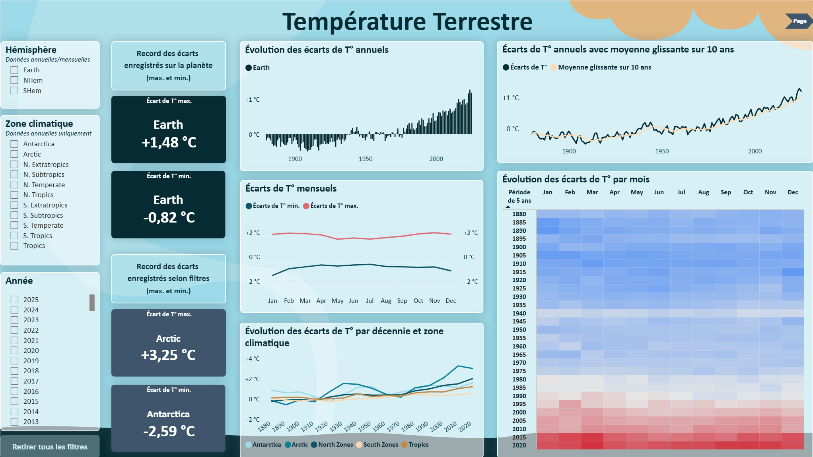

Cette première page permet d'explorer l'évolution des anomalies de température selon différentes échelles temporelles et géographiques, grâce aux filtres interactifs disponibles dans le rapport.

#### Analyse des émissions de CO₂

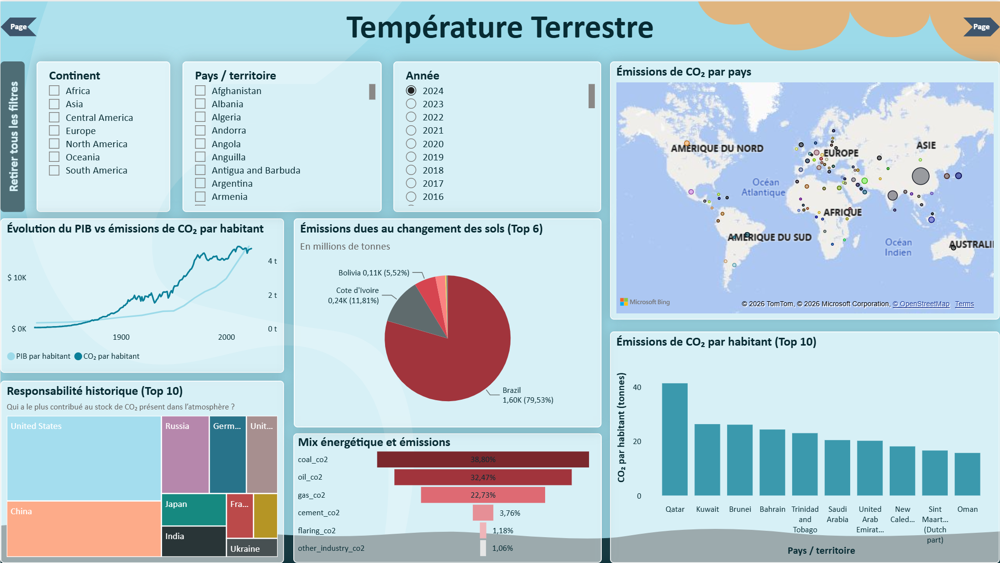

Cette seconde page analyse les émissions de CO₂ sous différents angles : répartition géographique, émissions par habitant, responsabilité historique, changement d'affectation des sols et mix énergétique.

#### Analyse des corrélations

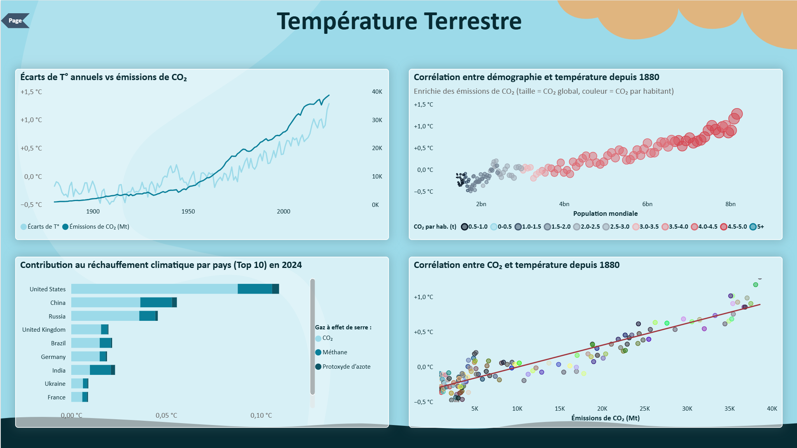

La dernière page met en relation les anomalies de température avec les émissions de CO₂, la démographie et la contribution des différents pays au réchauffement climatique.

## Présentation collective du projet

Le projet s'est conclu par une soutenance collective présentant la démarche suivie, les principaux constats issus de nos analyses ainsi que les enjeux liés à l'évolution des températures mondiales.

La présentation a été structurée autour de cinq grandes étapes : le contexte, le constat du réchauffement climatique, l'étude de ses causes et conséquences, l'accélération observée et les extrapolations, puis une conclusion générale.

  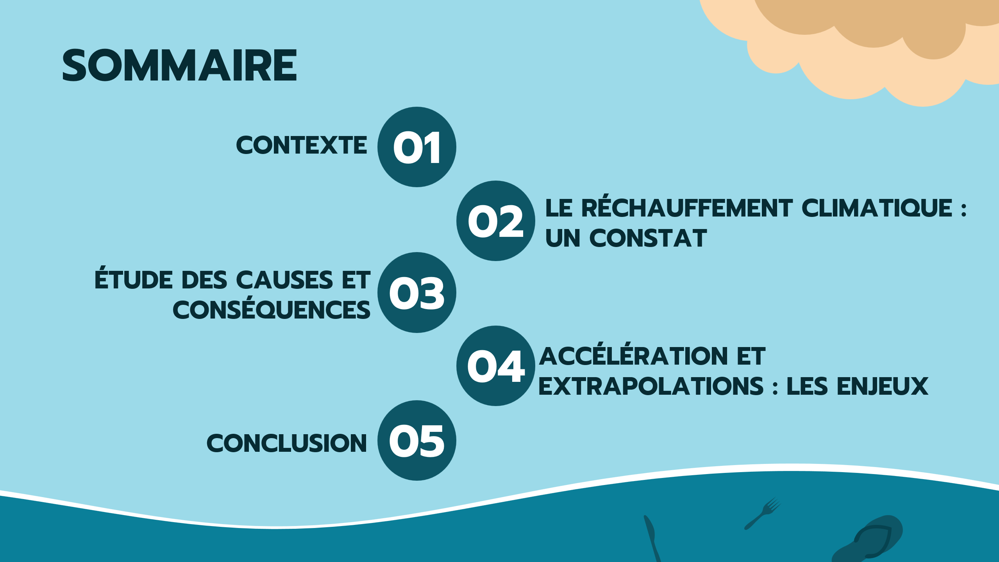

### Extraits de la présentation

Parmi les analyses présentées lors de la soutenance, plusieurs résultats issus de nos travaux ont permis d'illustrer les disparités géographiques du réchauffement et la relation observée entre les émissions mondiales de CO₂ et l'évolution des températures.

  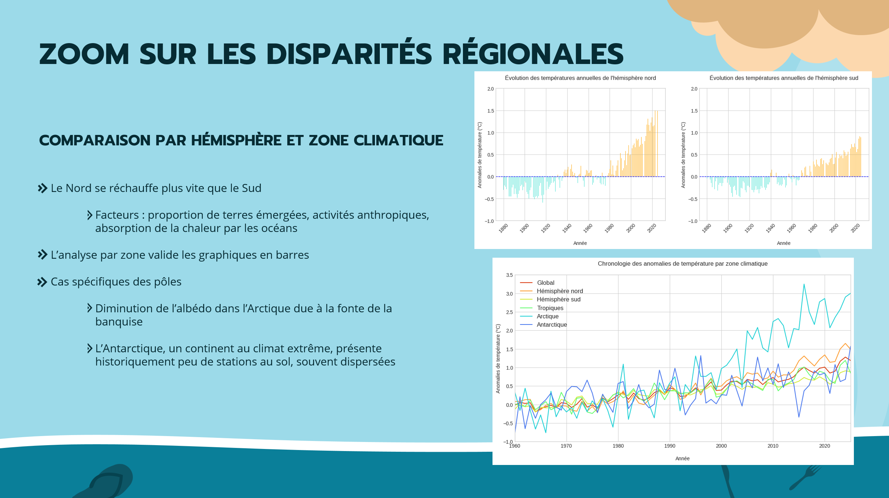

  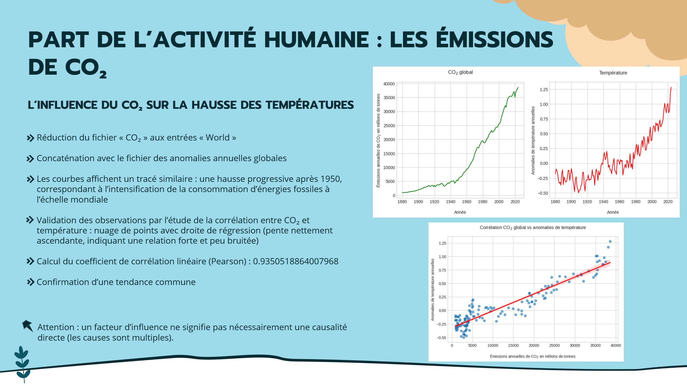

Cette présentation constitue un travail collectif réalisé à partir des analyses produites par les différents membres de l'équipe. Certains graphiques intégrés à la présentation sont issus de mes propres analyses, notamment ceux portant sur le découpage géographique des anomalies de température.

## Livrables du projet

Les principaux livrables sont disponibles directement dans ce dépôt :

- [Rapport individuel](report/global_temperature_individual_report.pdf)
- [Rapport Power BI interactif](power%20bi/global_temperature_dashboard.pbix)
- [Présentation collective](presentation/global_temperature_project_presentation.pdf)

## Sources

- **NASA Goddard Institute for Space Studies (GISS)** — GISTEMP v4, données L-OTI et AIRS v7  
  https://data.giss.nasa.gov/gistemp/data_v4.html

- **Our World in Data (OWID)** — CO₂ and Greenhouse Gas Emissions  
  https://ourworldindata.org/co2-and-greenhouse-gas-emissions